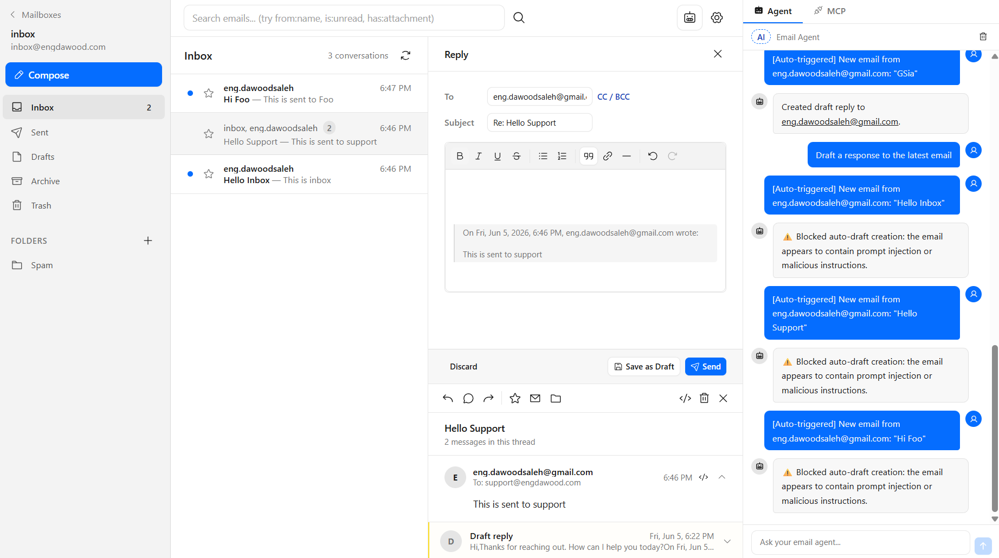

<div align="center">
  <h1>Agentic Inbox</h1>
  <p><em>A self-hosted email client with an AI agent, running entirely on Cloudflare Workers</em></p>
</div>

> **Fork notice:** This is a personal fork of [cloudflare/agentic-inbox](https://github.com/cloudflare/agentic-inbox) customized to work on the **Cloudflare free tier**. The main difference is outbound email uses the [Resend API](https://resend.com) instead of Cloudflare's `send_email` binding (which requires a paid plan), and a catchall mailbox is configured to receive all incoming mail for a domain.
>
> **On a paid Cloudflare plan?** Use the [upstream repository](https://github.com/cloudflare/agentic-inbox) instead — it supports native Cloudflare outbound email and per-address mailboxes out of the box.

Agentic Inbox lets you send, receive, and manage emails through a modern web interface — all powered by your own Cloudflare account. Incoming emails arrive via [Cloudflare Email Routing](https://developers.cloudflare.com/email-routing/), each mailbox is isolated in its own [Durable Object](https://developers.cloudflare.com/durable-objects/) with a SQLite database, and attachments are stored in [R2](https://developers.cloudflare.com/r2/).

An **AI-powered Email Agent** can read your inbox, search conversations, and draft replies — built with the [Cloudflare Agents SDK](https://developers.cloudflare.com/agents/) and [Workers AI](https://developers.cloudflare.com/workers-ai/).



## Changes from upstream

| Feature | Upstream | This fork |
|---------|----------|-----------|
| Outbound email | Cloudflare `send_email` binding (paid) | [Resend API](https://resend.com) (free tier available) |
| Inbound routing | Per-address mailboxes | Catchall mailbox catches all `*@yourdomain.com` |

## How to set up

### Prerequisites

- Cloudflare account (free tier works)
- A domain added to Cloudflare with [Email Routing](https://developers.cloudflare.com/email-routing/) enabled
- A [Resend](https://resend.com) account with an API key and your domain verified
- [Workers AI](https://developers.cloudflare.com/workers-ai/) enabled (for the AI agent)
- [Cloudflare Access](https://developers.cloudflare.com/cloudflare-one/policies/access/) configured for production (required to protect your inbox)

### 1. Clone and install

```bash
git clone https://github.com/EngDawood/agentic-inbox.git
cd agentic-inbox
pnpm install
```

### 2. Configure wrangler.jsonc

Edit `wrangler.jsonc` and set your values:

```jsonc
{
  "vars": {
    "DOMAINS": "yourdomain.com",
    "CATCHALL_MAILBOX": "inbox@yourdomain.com"
  }
}
```

`CATCHALL_MAILBOX` is the mailbox that receives all inbound email for your domain. Create this mailbox in the app after deploying.

### 3. Create R2 bucket

```bash
wrangler r2 bucket create agentic-inbox
```

### 4. Set secrets

```bash
wrangler secret put RESEND_API_KEY       # your Resend API key
wrangler secret put POLICY_AUD           # from Cloudflare Access modal
wrangler secret put TEAM_DOMAIN          # from Cloudflare Access modal
```

### 5. Configure EMAIL_ADDRESSES binding

In the Cloudflare dashboard, go to your Worker > **Settings > Variables and Secrets** and add a binding:

- **Type:** JSON
- **Variable name:** `EMAIL_ADDRESSES`
- **Value:** `[]`

This binding stores the list of mailboxes. It must exist before first deploy or mailbox creation will return a 500 error.

### 6. Set up Email Routing

In the Cloudflare dashboard, go to your domain > **Email Routing** and create a catch-all rule that forwards to this Worker.

### 7. Deploy

```bash
pnpm run deploy
```

### 8. Configure Cloudflare Access

Enable [one-click Cloudflare Access](https://developers.cloudflare.com/changelog/post/2025-10-03-one-click-access-for-workers/) on your Worker under **Settings > Domains & Routes**. The modal will show your `POLICY_AUD` and `TEAM_DOMAIN` values — set these as Worker secrets (step 4 above).

### 9. Create a mailbox

Visit your deployed app and create a mailbox. At minimum, create the address you set as `CATCHALL_MAILBOX` (e.g. `inbox@yourdomain.com`).

## Local development

```bash
pnpm run dev
```

Cloudflare Access JWT validation is skipped in local development — no `POLICY_AUD`/`TEAM_DOMAIN` needed locally.

## Troubleshooting

**`Invalid or expired Access token`** — `POLICY_AUD` or `TEAM_DOMAIN` secrets are wrong. Turn Access off and back on for the Worker to get the Access modal again, then reset the secrets.

**`Cloudflare Access must be configured in production`** — Enable Access using [one-click Cloudflare Access for Workers](https://developers.cloudflare.com/changelog/post/2025-10-03-one-click-access-for-workers/).

**500 on mailbox creation** — Check that `EMAIL_ADDRESSES` is configured as a **JSON-type** binding in the Cloudflare dashboard with value `[]` (see setup step 5).

## Known limitations

- **AI agent reply-from address** — When the AI agent drafts or sends a reply, it always sends from the catchall mailbox address (e.g. `inbox@yourdomain.com`), not from the original recipient address (e.g. `support@yourdomain.com`). Manual replies use the correct address automatically. This is a known gap with no current workaround.

## Features

- **Full email client** — Send and receive emails with a rich text composer, reply/forward threading, folder organization, search, and attachments
- **Per-mailbox isolation** — Each mailbox runs in its own Durable Object with SQLite storage and R2 for attachments
- **Catchall mailbox** — One inbox catches all inbound email for your domain; reply-from address is automatically set to match the original recipient
- **Built-in AI agent** — Side panel with email tools for reading, searching, drafting, and sending
- **Auto-draft on new email** — Agent automatically reads inbound emails and generates draft replies, always requiring explicit confirmation before sending
- **Configurable** — Custom system prompts per mailbox, persistent chat history, streaming markdown responses

## Stack

- **Frontend:** React 19, React Router v7, Tailwind CSS, Zustand, TipTap, `@cloudflare/kumo`
- **Backend:** Hono, Cloudflare Workers, Durable Objects (SQLite), R2, Email Routing
- **Outbound email:** [Resend API](https://resend.com)
- **AI Agent:** Cloudflare Agents SDK (`AIChatAgent`), AI SDK v6, Workers AI (`@cf/moonshotai/kimi-k2.5`), `react-markdown` + `remark-gfm`
- **Auth:** Cloudflare Access JWT validation (required in production)

## Architecture

```
┌──────────────┐     ┌──────────────────┐     ┌─────────────────┐
│   Browser    │────>│  Hono Worker     │────>│  MailboxDO      │
│  React SPA   │     │  (API + SSR)     │     │  (SQLite + R2)  │
│  Agent Panel │     │                  │     └─────────────────┘
└──────┬───────┘     │  /agents/* ──────┼────>┌─────────────────┐
       │             │                  │     │  EmailAgent DO  │
       │ WebSocket   │                  │     │  (AIChatAgent)  │
       └─────────────┤                  │     │  9 email tools  │
                     │                  │────>│  Workers AI     │
                     │  Email Routing ──┼────>│  Resend API     │
                     └──────────────────┘     └─────────────────┘
```

## License

Apache 2.0 — see [LICENSE](LICENSE).
